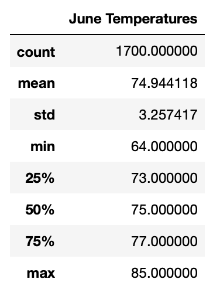
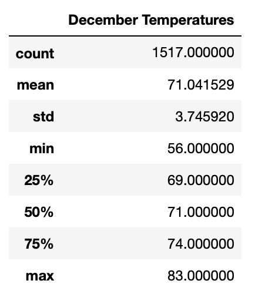

# Surfs-Up Analysis of Temperature Data

## Overview of Analysis
The purpose of this analysis was to compare temperature statistics for the months of June and December in Oahu, Hawaii. W. Avy would like to see if a surf shop and an ice cream shop would be promising investments to make and would like to see if the businesses would be functional year-round, based on the weather. 

## Results
After analyzing the statistical breakdown from June and December temperature data, these were the results gathered: 

Comparing the two data sets, they don't differ by a large amount. Both June and December generally have temperatures in the 70's, which is not hot, but is reasonable enough for surfing and/or having ice cream. After all, surfers usually surf in wetsuits anyway, so the temperature isn't that big of a deal. Based on this data, we can conclude that year-round, temperatures don't change very much on Oahu.
- The mean temperature is just 3 degrees F higher in June than in December
- The standard deviation is more or less the same, indicating that the datasets have a similar distribution of temperature data, and are comparable
- Although the minimum temperatures have the greatest difference between the datasets, the standard deviation still points to comparable numbers between the two months. Meaning that although December temperatures could get to 56 F, it is not very likely, as the rest of the numbers in December are just a few degrees lower, and the standard deviation is the same.

## Summary
Generally speaking - opening a surf shop and an ice cream shop in Hawaii is not a bad idea. Temperatures throughout the year don't change very much, although they aren't hot either, so the ice cream shop may not perform as well as the surf shop. Since Hawaii is known to be rainy, I would look at precipitation data for June and December, along with wind data. When it's raining people generally don't want to be surfing, and when it's too windy, the waves may become too big!
